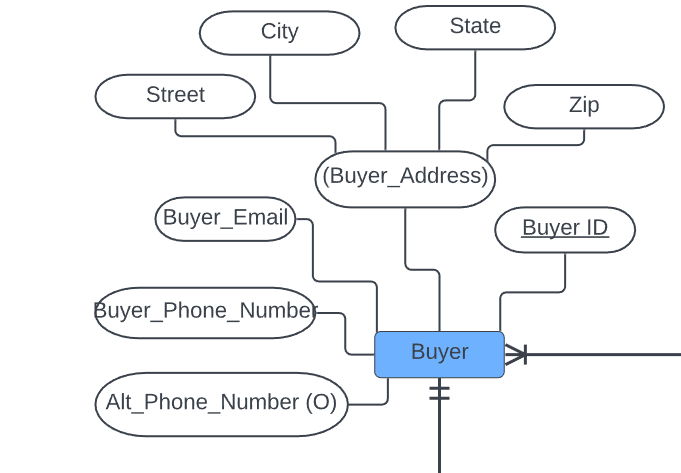
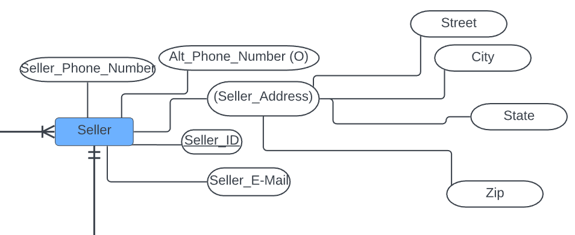
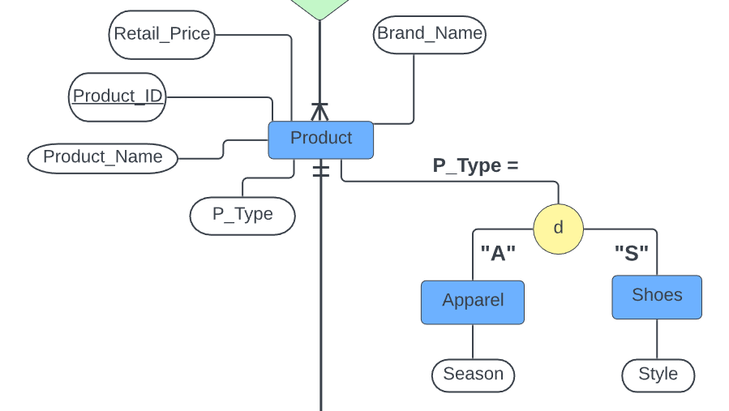
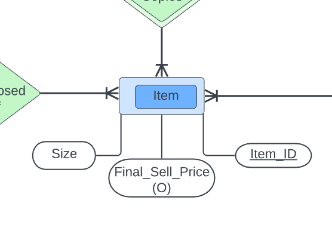
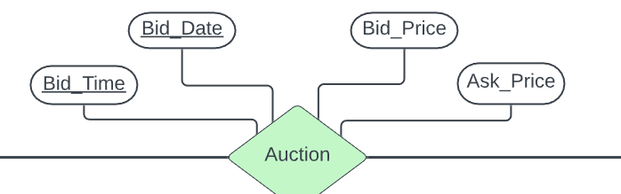
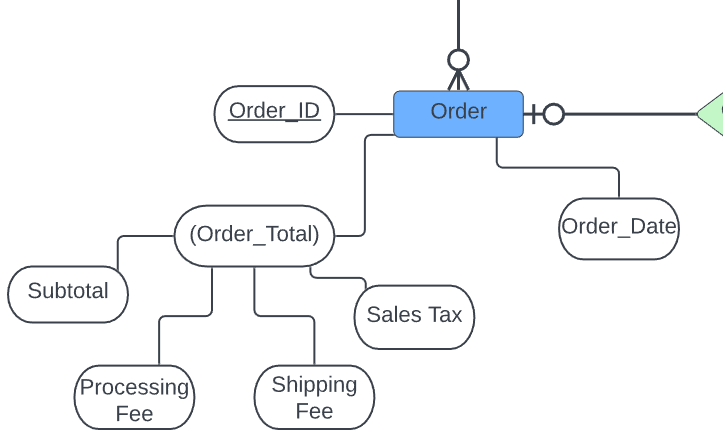

## Hi! Welcome to my project about StockX. 
### I'll walk you through my process of exploring Stock's database and ER diagram structure and using SQL to query and solve business problems.

### Skills Used:
* Excel/Google Sheets
* Python
* SQL

### Contents (click to skip to each section)
* [Entity-Relationship Diagram](#erd)
* [Creating the Dataset](#dataset)
* [Continuing with Python](#python)
* [SQL Queries](#sql)

#### For those unfamilar with StockX, it is an anonymous online marketplace that mimics the stock market, except it sells luxury or limited edition sneakers, accessories, apparel, electronics, and more. StockX provides verification services to make sure products are genuine and not a cheap imitation, and earns commissions on sales.
#### There is full transparency on ask prices, bid prices, and ask prices. There are even convenient visualizations on price history as well as your typical stock market data including:
* 12-month trade range
* all-time trade range
* price premium (%)
* volatility
* number of sales
* average sale price

## Let's dive right in!
---
### 1. The first step is to understand StockX's entity-relation diagram.

### To briefly explain the ER diagram, the main entities to take into account are the buyers, sellers, and the products.
### NOTE: Not all columns will appear on the diagram as it does not include foreign keys.

#### The Auction entity is the associative entity created by the relationship between the 3 main entities.
* AKA ternary relationship where many Buyers can buy many Products from many Sellers.

#### Products have subtypes to categorize them. For simplicity, I've only included Shoes and Apparel subtypes.
#### The Item entity may be confusing. Here, the important thing to understand is that it is necessary to identify different instances of the same type of shoe.
* RandomBrand-Shoe1 has many "copies" and different sellers may be selling the same shoe model.
* This is similar to a library book having many copies. They would want to track which copy is being borrowed by a certain reader.

#### An Order is made when a Buyer makes a winning bid or when the Buyer meets the ask price.
####
---

### 2. Next, let's take a look at the tables in detail.

#### Web scraping would have been the easiest way to collect the data, but having tried using Octoparse, I realized that the website (understandably so) protects itself from scraping programs. I will be making a sample database from SCRATCH. This is a good time to practice my spreadsheet skills!

#### I want to make this mock database as realistic as possible and random number generators (RNG) will be VERY useful. 
#### Where should we start?
#### If you want to view the full dataset, open the following link in a new tab.
#### [StockX Project Data](https://docs.google.com/spreadsheets/d/1VxAQSSVYZIjkwwO6W6RQ8l1BCVW3h5S1h9pl-n1kexs/edit?usp=sharing)
#### You will be able to view all of the complex formulas I spent an unnecessary amount of time writing to make this dataset! :D

#### A RNG sheet is included from which I randomly draw data from to create the attributes for other tables. The sheet includes:
* List of all 50 states
* List of all state capitals
* 400 random cities
* Popular email domains
* 107 sample usernames
* 300 street names
* A-Z
* 100 last names (from which usernames was made)
* Apparel sizes (S/M/L/XS/XL/XXL)

##### If you view the RNG sheet, you will notice that the email domains and apparel sizes will be listed more than once at different frequencies. 
* For emails, this is to simulate popularity of the domain, with Gmail, Yahoo, and Outlook being much more popular than domains such as AOL, iCloud, and ATT. 
* For apparel sizes, Medium will be the most common, Small and Large slightly less common, and the X sizes being the least common.

### <ins> Buyer/Seller Tables </ins>
#### As there are 6.5 million buyers on StockX and 1 million sellers, I decided to maintain the 6.5:1 ratio. 130 Buyers and 20 Sellers should do!

  
   

#### Attributes/Columns:
* ID
* Email
* Phone Number
* Alternate Phone Number (optional)
* Street
* City
* State
* Zip

#### ID is very simple to make. I generated a random 4-digit number using the following formula:
* =RANDBETWEEN(1,9999)
* I used custom number formatting (B-0000 and S-0000) to indicate whether it was a Buyer or Seller ID.

#### Emails are slightly harder. There are infinite email addresses but a common pattern is first initial, last name, random number, @domain.
* =CONCATENATE(INDEX('RNG (DELETE LATER)'!$G$1:$G$28, RANDBETWEEN(1,28)), INDEX('RNG (DELETE LATER)'!$E$2:$E$107, RANDBETWEEN(1,106)), RANDBETWEEN(10,999),INDEX('RNG (DELETE LATER)'!$D$2:$D$22, RANDBETWEEN(1,21)))
* The first intial is drawn from A-Z in the RNG sheet. You'll notice I put 1:28, which is to add the chance of someone not using a first initial.
* Draws random username
* Generates random number
* Draws random email domain

#### Phone number is simple. I generated a random 10-digit number using the following formula:
* =RANDBETWEEN(1000000000, 9999999999)
* Custom number formatting (###)-###-####

#### Alternate phone number is optional. Around 1/6 people have multiple phones.
* IF(D2=1,CONCATENATE(LEFT(C2,6),RANDBETWEEN(100, 999),"-",RANDBETWEEN(1000,9999)), IFERROR(0/0))
* If RANDBETWEEN(1,6) lands on 1, generate number, otherwise remains blank
* Keeps zip code of main phone number, generates another random number

#### Street
* =CONCATENATE(RANDBETWEEN(1,9999)," ",INDEX('RNG (DELETE LATER)'!$F$2:$F$301, RANDBETWEEN(1,300)))
* Generate random number, draw street name from RNG sheet
* Ex. 3910 Highland Avenue

#### State
* Generated first before City, randomly draw from RNG sheet

#### City
* =IF(G2 = 1, INDIRECT(CONCATENATE("'RNG (DELETE LATER)'!B", MATCH(I2, 'RNG (DELETE LATER)'!$A$2:$A$51)+1)), INDEX('RNG (DELETE LATER)'!$C$2:$C$401, RANDBETWEEN(1,400)))
* Around 1/12 people live in a capital city. Of course, it differs by state but we will use an average for simplicity.
* If RANDBETWEEN(1,12) lands on 1, draw ACCURATE state capital from RNG sheet
* Otherwise, choose random city (may or may not be accurate)

#### Zip (randomly generated and not accurate to the actual location)
* =RANDBETWEEN(0,99950)

 

### <ins> Products Table </ins>

 

#### Attributes/Columns:
* Product Name
* Brand
* Retail Price
* Product Type

#### For the products, I merely copy pasted a few products from the front page of the StockX website and pasted it into the spreadsheet. Of course, this still requires cleaning to make sure that the data is in the correct type and format.
* Data cleaning shown on "Sheet 9" and "Sheet 10" of the spreadsheet

#### Shoes and Apparel are also separate tables that contain Product ID and Product Type. Not much to talk about for these tables.

 

### <ins> Items Table </ins>

 

#### As mentioned previously, Items represent one specific iteration of a general Product. A logistic curve distribution was implemented to somewhat emulate reality in terms of how many products a Seller had. Many Sellers only had one item listed, a few less Sellers had two items listed, fewer Sellers had three items listed, and so on.

#### Attributes/Columns:
* Seller ID
* Product ID
* Item ID
* Size
* Order ID (Optional)
* Final Sell Price (Optional)

#### Seller ID
* This was not completely** randomly generated. I followed the logistic curve plan illustrated in Columns J and K in the RNG sheet and ensured that every Seller had at least 1 item. (You wouldn't be a seller if you don't have any items for sale)
* After the first 60 Items, I reintroduced randomness into the Items table. You will notice many NA's as the formulas try to match the data to empty rows.

#### Product ID
* Randomly picked out of the 50 Products

#### Item ID
* Randomly generated number from 1 to 100
* Very small chance of matching Product AND Item ID, but this should do the trick for this small of a dataset

#### Size
* If Product ID is Shoe type, generate random number from 4-12 (most common range that I saw)
* If Product ID is Apparel type, generate random size based on distribution in RNG sheet Column I

#### Order ID and Final Sell Price
* These 2 columns are OPTIONAL and will only be filled when a winning bid is made
* Filling in these columns proved to be an extreme hassle for me to do in Google Sheets and I had to use Python to fill these in (more in next sections)

 

### <ins> Auction Table </ins>

 

#### Attributes/Columns:
* Buyer ID
* Seller ID
* Product ID
* Bid Date
* Bid Time
* Bid Price
* Ask Price

  

#### Buyer ID
* Randomly generated from Buyer list, anyone can bid on whichever item

#### Product ID
* Must be randomly generated BEFORE Seller ID, as Buyers must bid on existing Products
 
#### Seller ID
* =INDEX(INDIRECT(CONCAT("'Item Data'!A2:A",COUNT('Item Data'!A:A)+1)), MATCH(D2, INDIRECT(CONCAT("'Item Data'!B2:B",COUNT('Item Data'!A:A)+1)),0))
* Above formula essentially cross checks to match the Product ID with an existing Seller
* There could be multiple Sellers selling the same product, but the MATCH() function will only find the first 1. This could be a problem!
* However, this is still realistic as the first Seller to post the same item should have theirs bid on and sold first.

#### Bid Date and Bid Time
* Originally, bid dates and time were generated from a very large range.
* But it doesn't make sense that auctions would run on for that long of a time frame if I generated dates and times from an entire year.
* Here, I decided to make this dataset represent a snapshot of ONE MONTH of StockX's dataset.

#### Bid Price
* Before doing a random range bid range, I did some research on typical bid ranges for products (shown on "Sheet 11")
* It seems bids often range from 60% to 100% of the ASK PRICE
* This is generated AFTER Ask price

#### Ask Price
* =IF(COUNTIF(D:D, D2)>1, MAX(FILTER(H:H,D2 = D:D)), VLOOKUP(D2,'Product Data'!$A$2:$C$51,3) * (1+ RANDBETWEEN(25,75)/100))
* Generated from a random markup between 25% to 75% of the RETAIL PRICE
* This is typical given the nature and rarity of the products sold on the platform.
* MORE PROBLEMS: Because it is randomly generated, there could be many different ask prices for the same Product.
* This could make sense in real life, but on the anonymized platform, only ONE Ask Price is seen.
* The formula checks if there are multiple instances of the same product being bid on (generated in a temporary "RNG" column, and it will keep the MAX Ask Price that the Buyers will see

 

### <ins> Orders Table </ins>

 

#### Attributes/Columns:
* Order ID	
* Buyer ID	
* Order Date	
* Subtotal	
* Processing Fee	
* Shipping Fee 
* Sales Tax	
* Order Total

#### This is our final table, but it doesn't get easier! An Order row being inserted into this table means that a winning bid was made on a specific Product/Seller pair. But because I couldn't find a function that looks at unique pairs between multiple columns, I had to create temporary columns as identifiers in the Items and Auction tables. I concatenated columns to create identifiers (SP Combo, BSP Combo, SP + Bid Price Combo, etc)

#### Because I was using formulas to generate numbers, updating cells or pressing "Enter" would change the entire dataset each time. Not only is it an eyesore, it's difficult to make sense of what's going on. I exported a STATIC dataset in order to understand it better.

#### If you view the Items sheet (everything past Column H), you will see my annoyances with spreadsheets.
* WHY IS THE MATCH FUNCTION SO F****** ANNOYING?!?!
* For some reason, it could not match the all identifiers and returns NA for many of them, DESPITE me manually verifying that they exist (with Ctrl + F)
* Playing with data types and trying 100 different things wasn't working

 

## Switching to Python!!!

#### I documented my process of completing the dataset with Python in Jupyter Notebook. Please right click the following link and view in a different tab.
#### [Completing Dataset in Python](https://github.com/AZheng1234/AZheng1234.github.io/blob/main/StockX/Auction-Item%20Data.ipynb)

 

#### To reiterate in simple terms:
* I needed to find the MAX bid for each Product/Seller pair
* MAX bid becomes an Order
* MATCH() function sucks
* Winning Bid Price goes to Items table, Final Sell Price and Orders table, Subtotal
* Winning Buyer ID also goes to Orders table
* MATCH() function sucks again (or I suck at spreadsheets)

#### Python and Pandas was very useful for solving this seemingly simple problem! Final Sell Price column is now complete!

  

#### Even after using Python, the dataset isn't completely finished. Let's continue with the Orders table columns. 
#### Order ID
* After filling in Final Sell Price column in Items table, the Order ID was generated by concatenating "Nov2022" and a random 4-digit number

#### Buyer ID and Order Date
* This is extracted using INDEX() and MATCH() in the Auction table to find the winning Buyer and Date

#### Subtotal
* It was also possible that a Buyer has multiple winning bids
* If this happened, wins would be grouped into a single order

#### Processing Fee
* StockX charges a fee for authentication of an item
* Equal to the greater of $4.95 or 4% of subtotal

#### Shipping Fee
* Flat $14.95

#### Sales Tax
* I looked up sales tax rates on Wikipedia and exported the table (found on "States Tax" sheet)
* I realize that this does not include local county or city taxes, but this estimate was good enough for this project.

#### Order Total
* Sum of the previous columns

 

### This final stretch for completing the dataset had a few more problems that I don't fully remember the details about. All I remember is that the formulas were not properly retrieving order totals, Buyer ID, Order ID, etc. I had to manually input some of the data in order to complete the Orders table. There were EVEN MORE annoyances when it came to importing it into XAMPP to use SQL with data types, table names, creating tables, etc, but I won't go into detail :)

#### Here is the final completed dataset! (static, no formulas, values only)
[StockX Completed Dataset](https://docs.google.com/spreadsheets/d/1DHW1f13lUfL05oVN4cEC2_2wLdL_fINWHcSfVM5Tlvc/edit?usp=sharing)

 

## Time for SQL!!!

#### I created a list of questions and SQL queries that I thought would be useful/interesting insights!
[SQL Questions](https://github.com/AZheng1234/AZheng1234.github.io/blob/main/StockX/SQL%20Questions.pdf)

#### If you want to explore my dataset more, I have attached my SQL dump file below:
[SQL Dump File](https://github.com/AZheng1234/AZheng1234.github.io/blob/main/StockX/SQL%20Dump%20File.sql)

### This is the end! Thanks for reading about my project and making it this far! I hope you found it somewhat interesting at least. 
### A LOT of effort and headache went into this when it was just supposed to be a SQL focused project for Database Management. There may be some logical flaws that I haven't caught when I did this project, but I wanted to make it AS ACCURATE AS POSSIBLE to the real deal. For funsies :) In any case, I learned a lot!
