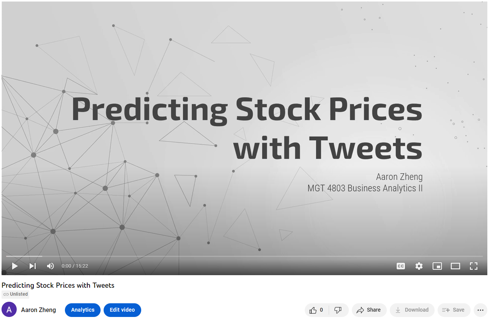

### GITHUB PAGE-IN PROGRESS
### Project is complete but currently editing Readme file

  
   

## Hi! Welcome to my project about predicting stock prices with social media. 
### I'll walk you through my process of exploring the relationship between Elon Musk's Tweets and TSLA stock price.

### Skills Used:
* Excel/Google Sheets
* R/RStudio

### Contents (click to skip to each section)
* [15-minute Video Summary](#video)
* [Creating the Dataset](#dataset)
* [Continuing with Python](#python)
* [SQL Queries](#sql)

 

### If you don't want to read about the details on Github, here is a video I made for this project.
 

 

 

### If you would rather read a more formal paper, you can read it using the link below. You will have to download to view the docx file.
### [Formal Report](https://github.com/AZheng1234/AZheng1234.github.io/blob/main/Twitter/Report.docx)
